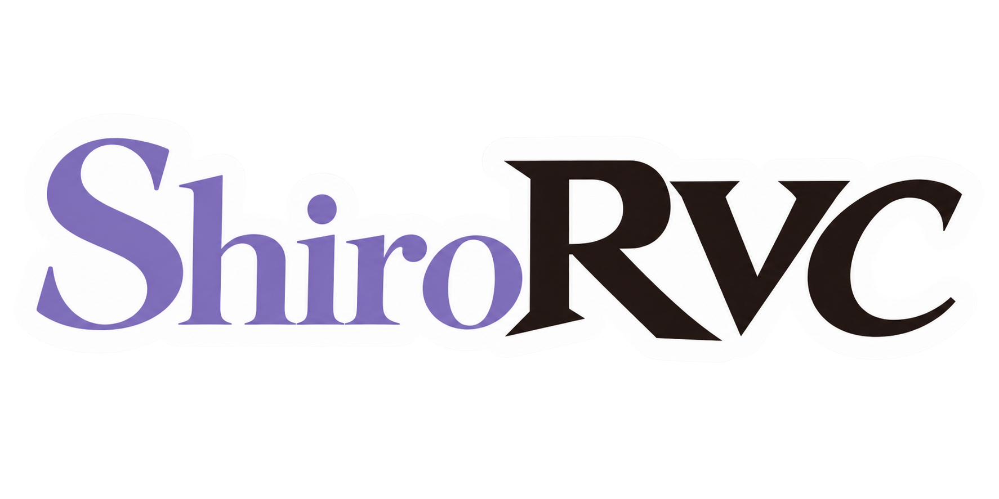

<div align="center">



# ShiroRVC

**Turn one voice into another — speaking or singing.**

Record yourself, convert it to a voice you have trained, and keep the melody,
the timing and the emotion of the original performance. Runs on your own
computer, or on a free cloud GPU.

[](https://www.python.org/)
[](https://pytorch.org/)
[](https://www.gradio.app/)
[](LICENSE)

[](https://colab.research.google.com/github/ShiromiyaG/ShiroRVC/blob/main/assets/ShiroRVC_Colab.ipynb)

</div>

---

## What you can do with it

- **Convert a voice** — one file or a whole folder at once. Singing works as
  well as speech, and you can nudge the pitch curve by hand if a note lands
  wrong.
- **Train your own voice** — feed it clean recordings of someone and get a model
  you can use forever after.
- **Type and hear it spoken** — text-to-speech routed through any voice you have.
- **Blend two voices** — mix two models into a third one that sounds like both.
- **Bring in voices from elsewhere** — paste a link, drop in files you already
  have, or download ready-made starting points.

## Getting started on Windows

Download `ShiroRVC-Setup-win64-<version>.zip` from the
[latest release](../../releases/latest), unzip it and run `ShiroRVC-Setup.exe`.

The wizard downloads everything else for you and picks the right version for
your graphics card automatically. It does not ask for administrator rights and
writes nothing outside the folder you choose, so uninstalling is deleting that
folder. Set aside about 14 GB of disk space.

When it finishes, run `ShiroRVC.exe` from that folder.

### Trying it without installing anything

[](https://colab.research.google.com/github/ShiromiyaG/ShiroRVC/blob/main/assets/ShiroRVC_Colab.ipynb)

Runs in your browser on a free Google Colab GPU — useful if you do not have a
graphics card, or just want to try it first. Set the runtime to **T4 GPU**, run
the two cells, and open the link the second one prints.

Nothing is kept between sessions: when the Colab session ends, anything you did
not download is gone. For real training, install it properly.

> Windows will likely warn you about an unrecognised app. That is because the
> installer is not code-signed, which costs money we have not spent — not
> because anything was detected. Every release lists checksums you can verify.

### Installing from the source code

<table>
<tr><th align="left">Windows</th><th align="left">Linux</th></tr>
<tr valign="top">
<td>

```bat
run-install.bat
start-gui.bat
```

</td>
<td>

```bash
chmod +x run-install.sh start-gui.sh
./run-install.sh
./start-gui.sh
```

</td>
</tr>
</table>

This builds a self-contained environment in `env/`. Nothing is installed
system-wide and no Python you already have is touched. The models it needs
download by themselves the first time you launch it.

> **Note** — do not run either script as administrator or root. Both write into
> the project folder, and doing so leaves files your normal user cannot change
> afterwards.

## Three ways to use it

All three drive the same engine and share the same `logs/` folder, so a voice
you train in one shows up immediately in the others.

| | Start it with | Best for |
| --- | --- | --- |
| **Desktop app** | `start-gui.bat` / `start-gui.sh` | Day-to-day use. Waveform editing, live training charts, a graphics-memory meter and a batch queue. If the engine crashes, the window stays up. |
| **In your browser** | `start-gradio.bat` / `start-gradio.sh` | Reaching it from another machine, or over a tunnel. |
| **Command line** | `python core.py --help` | Scripting and automation. The other two are built on top of these commands. |

The desktop app lives entirely in [`gui/`](gui/README.md) and is optional —
deleting that folder leaves the browser version and the command line working.

## Training your own voice

Put clean audio in a folder under `assets/datasets/`, then pick it in the
Training tab.

- Keep the recordings consistent — same microphone, same room, same tone.
- Cut the silence off the start and end. **SmartCutter** can do it for you.
- Twenty clean minutes beats two noisy hours. Quality matters far more than
  quantity.

Behind the scenes, preparation writes two copies of your audio: one at full
quality for training and a smaller one used only to analyse pitch. The app
offers to delete the smaller copies afterwards, which frees about a third of the
space. Say yes unless you plan to redo the analysis with different settings —
that step needs them back.

### Watching it learn

Drag a model folder onto `logs/run_tensorboard_in_model_folder.bat`, or on Linux
pass it as an argument:

```bash
./logs/run_tensorboard_in_model_folder.sh logs/my-model
```

Charts open in your browser on port `25565`, reachable from other machines on
your network.

## Language

Both interfaces ship in English and Brazilian Portuguese, and start in whatever
language your operating system displays. On Windows that is the "Windows display
language" and not the format locale — so an English Windows in Brazil gets an
English interface with Brazilian number formats, which is what each of those
settings actually asks for.

| | How to change it |
| --- | --- |
| **Desktop app** | The **Language** button at the bottom of the sidebar. It offers to restart, because each part of the window takes its text when it is built. |
| **In your browser** | *Settings → Language*, applied next time you start it. Or launch with `--language pt_BR`. |
| **Either** | Set `RVC_LANGUAGE=pt_BR`. |

Never having touched the switch is not the same as having chosen English:
someone who never opened it keeps following the operating system, while an
explicit choice of English survives switching Windows to another language.

The command line stays in English on purpose — the desktop app reads its output,
and its messages end up quoted in bug reports.

<details>
<summary><b>Helping translate</b></summary>

Catalogs are standard gettext `.po` files under `locales/`, so Poedit, Weblate
and Crowdin all work on them directly. The toolchain is standard-library only —
no Babel and no GNU gettext binaries to install:

```bash
python tools/i18n_tool.py extract   # sources -> locales/shiromiya.pot
python tools/i18n_tool.py update    # merge the template into every .po
python tools/i18n_tool.py compile   # .po -> .mo, which is what gets loaded
python tools/i18n_tool.py stats     # what is still untranslated
```

Adding a language is one entry in `LANGUAGES` in `rvc/lib/i18n.py`, then
`update` and `compile`. Two rules keep it working: `install()` runs before any
widget is built, and no translated string lives at module scope — mark those
with `N_()` and call `_()` where they are used. `tests/test_i18n.py` checks the
template is current and that placeholders survive translation, because a missing
catalog falls back to English silently rather than raising.

</details>

## Under the hood

<details>
<summary><b>The two voice engines</b></summary>

ShiroRVC ships two vocoders — the part that turns the model's internal
representation back into sound.

| | **HiFi-GAN** | **ChouwaGAN** |
|---|---|---|
| Sample rates | 32 / 40 / 48 kHz | 44.1 kHz |
| Frontend | Original VITS (flow + posterior) | Sequential VAE, slow + fast latents |
| Generator | NSF HiFi-GAN | Anti-aliased harmonic decoder with excitation U-Net |
| Discriminator | MPD + MSD | 5 period + 3 band-split complex STFT + PQMF sub-band |

**HiFi-GAN** is the well-tested option inherited from the original RVC, and the
right choice if you want results that behave predictably.

**ChouwaGAN** is what this fork exists for, aimed at singing at 44.1 kHz. Its
frontend splits the latent into a *slow* stream carrying timbre and a *fast*
stream carrying detail, each held at a target divergence by a KL rate controller
rather than being allowed to collapse. Its discriminator judges the compressed
**complex** STFT — real and imaginary parts, split into frequency sub-bands — so
the adversarial signal carries phase, which mel reconstruction losses cannot
supply. A PQMF sub-band branch watches inter-band consistency, where upsampling
aliasing shows up. Every branch uses a SAN head with lazy R1 regularisation.

</details>

<details>
<summary><b>What you can choose from</b></summary>

<table>
<tr><td><b>Pitch extraction</b></td><td><code>rmvpe</code> · <code>crepe</code> · <code>crepe-tiny</code> · <code>fcpe</code></td></tr>
<tr><td><b>Content embedders</b></td><td><code>contentvec</code> · <code>spin_v1</code> · <code>spin_v2</code> · custom</td></tr>
<tr><td><b>Optimizers</b></td><td>AdamW · Sched-Free AdamW · Muon · Lion</td></tr>
<tr><td><b>Spectral losses</b></td><td>L1 mel · multi-scale mel · hybrid L1</td></tr>
<tr><td><b>LR schedulers</b></td><td>exponential decay per step or epoch · cosine annealing · none</td></tr>
<tr><td><b>Export formats</b></td><td>WAV · MP3 · FLAC · OGG · M4A</td></tr>
</table>

Training writes live TensorBoard diagnostics for KL rate and per-dimension
usage, per-module gradient norms, GAN balance and a held-out split that is the
only signal able to see overtraining.

</details>

## Credits

- **[codename0og](https://github.com/codename0og/)** — SmartCutter, the learned
  silence-detection model used to trim dataset audio.
- **[dr87 / spin-for-rvc](https://github.com/dr87/spin-for-rvc)** — the `spin_v1`
  and `spin_v2` content embedders.
- [Retrieval-based Voice Conversion WebUI](https://github.com/RVC-Project/Retrieval-based-Voice-Conversion-WebUI)
  — the original RVC project this fork descends from.

## License

Released under the [MIT License](LICENSE).
