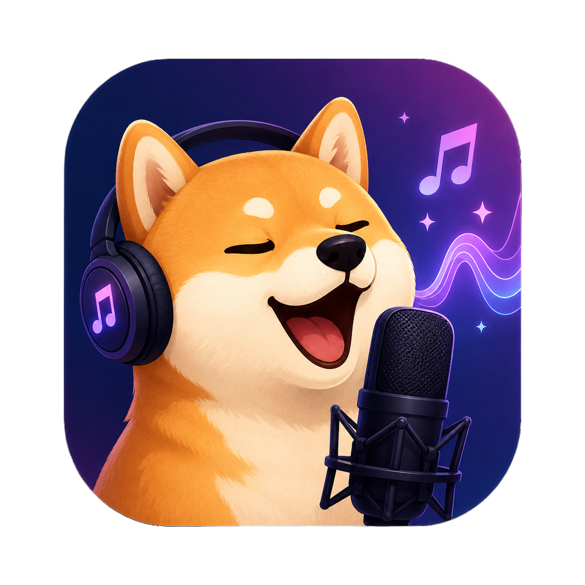

# ShiroRVC

  

RVC voice conversion and training with the original RVC architecture and NSF-HiFi-GAN vocoder.

## Features

- Voice conversion, training, TTS and batch inference through Gradio.
- RMVPE, CREPE and FCPE pitch extraction.
- Pitch-curve editing, model blending and model export.
- NSF-HiFi-GAN pretrained models for 32, 40 and 48 kHz.

## Architecture

The fork uses NSF-HiFi-GAN with the original MPD/MSD discriminator stack.

## Installation

1. Run `run-install.bat`.
2. Start the interface with `run-fork.bat`.
3. Open the local Gradio address shown in the terminal.

On first launch, required models and executables are downloaded automatically.

## Dataset

Place clean audio files in the dataset folder selected in the Training tab. Use consistent recordings, remove excessive silence, and keep the target sample rate consistent with the training model.

## References

- [Retrieval-based Voice Conversion WebUI](https://github.com/RVC-Project/Retrieval-based-Voice-Conversion-WebUI)
