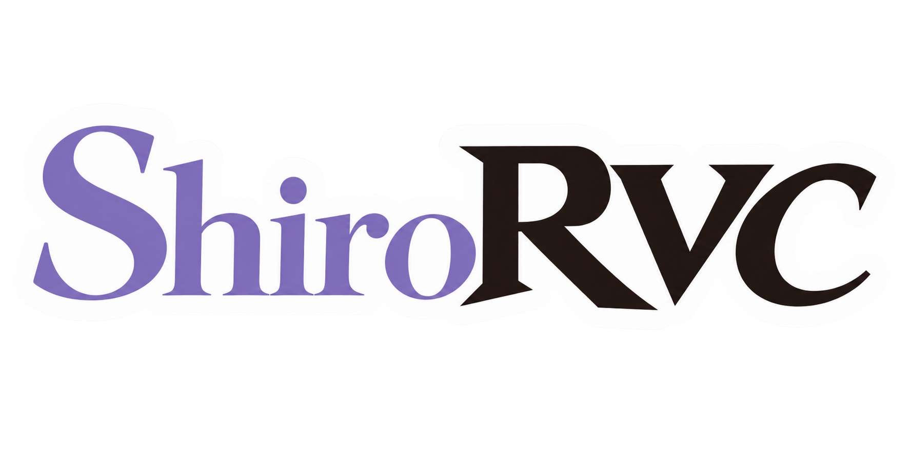

<div align="center">



**Turn one voice into another — speaking or singing.**

ShiroRVC is a voice conversion fork of [Applio](https://github.com/IAHispano/Applio)
built around a **rectified-flow** voice model: it keeps the melody, timing and
emotion of the original performance and renders the target voice as a 44.1 kHz
mel spectrogram, which a separate neural vocoder turns into sound. The classic
RVC pipeline is still here, side by side.

[](https://www.python.org/)
[](https://pytorch.org/)
[](https://www.gradio.app/)
[](LICENSE)

[](https://colab.research.google.com/github/ShiromiyaG/ShiroRVC/blob/main/assets/ShiroRVC_Colab.ipynb)

</div>

---

## Why rectified flow

Classic RVC decodes straight to a waveform from a VITS latent, so the voice
model and the vocoder are one network trained on one dataset. The rectified
pipeline splits them:

- **A flow model** turns content, pitch, loudness, breathiness and speaker into
  a mel spectrogram. It is small enough to fine-tune on a few minutes of one
  voice.
- **A vocoder** turns that mel into audio. It has no speaker input, so one good
  vocoder renders every voice model. You do not retrain it per voice.

The mel is OpenVPI SingingVocoders' — 44.1 kHz, hop 512, 128 bins from 40 Hz to
16 kHz — so their NSF-HiFiGAN releases, `pc-nsf-hifigan` included, work as the
vocoder out of the box.

## Getting started

<table>
<tr><th align="left">Windows</th><th align="left">Linux</th></tr>
<tr valign="top">
<td>

```bat
git clone https://github.com/ShiromiyaG/ShiroRVC.git
cd ShiroRVC
run-install.bat
start-gui.bat
```

</td>
<td>

```bash
git clone https://github.com/ShiromiyaG/ShiroRVC.git
cd ShiroRVC
chmod +x run-install.sh start-gui.sh
./run-install.sh
./start-gui.sh
```

</td>
</tr>
</table>

This builds a self-contained environment in `env/`. Nothing is installed
system-wide and no Python you already have is touched. The models it needs
download by themselves the first time you launch it. Set aside about 14 GB of
disk space.

To update later, run `git pull` inside the folder. If `requirements.txt`
changed, run the installer script again so the environment picks up the new
requirements.

> **Note** — do not run either script as administrator or root. Both write into
> the project folder, and doing so leaves files your normal user cannot change
> afterwards.

<details>
<summary><b>Installing into an existing Python environment</b></summary>

Cloud GPU templates (RunPod, Vast.ai, Jupyter images) usually come with their
own torch. Running `pip install -r requirements.txt` there replaces torch but
leaves the template's torchaudio, and the two end up built for different CUDA
versions. When that happens, the app stops at startup with
`PyTorch and TorchAudio were compiled with different CUDA versions`. To avoid
it, remove the preinstalled stack and install it from PyTorch's index first:

```bash
pip uninstall -y torch torchaudio torchvision
pip install torch==2.13.0 torchaudio==2.11.0 --index-url https://download.pytorch.org/whl/cu130
pip install -r requirements.txt
```

These are CUDA 13 builds, so the machine needs NVIDIA driver 580 or newer
(`nvidia-smi` shows the version).

</details>

## Three ways to use it

All three drive the same engine and share the same `logs/` folder, so a voice
you train in one shows up immediately in the others.

| | Start it with | Rectified flow lives in |
| --- | --- | --- |
| **Desktop app** | `start-gui.bat` / `start-gui.sh` | The **Rectified flow** page (`Ctrl+1`), with its own Inference and Training tabs, a live progress card that follows you to other pages, and "save a copy" on the result. |
| **In your browser** | `start-gradio.bat` / `start-gradio.sh` | The **Rectified** tab. |
| **Command line** | `python core.py --help` | The `rectified_*` commands. |

Both open on the rectified Inference tab. The classic pipeline sits next to it,
under **Classic RVC**, with its own Inference and Training tabs.

The desktop app lives entirely in [`gui/`](gui/README.md) and is optional —
deleting that folder leaves the browser version and the command line working.
The Colab notebook starts the browser version, **Rectified** tab included.

## Training a rectified-flow voice

Put clean audio in a folder under `assets/datasets/`.

- Keep the recordings consistent — same microphone, same room, same tone.
- Twenty clean minutes beats two noisy hours. Quality matters far more than
  quantity.
- **New Automatic** cutting finds the voice with a neural VAD rather than a
  loudness threshold, so you don't have to trim silence by hand.

Then run the steps in order. In the apps they are numbered; on the command line:

```bash
python core.py rectified_preprocess --model_name my-voice --dataset_path assets/datasets/my-voice
python core.py rectified_extract    --model_name my-voice --gpu 0
python core.py rectified_train_flow --model_name my-voice --gpu 0 \
    --pretrained_flow rvc/models/pretraineds/rectified/pretrain_flow_contentvec_cc_by_nc_sa.pth \
    --vocoder rvc/models/vocoders/<vocoder>.pth
python core.py index                --model_name my-voice   # optional
```

- **The starting point.** Fine-tuning from a pretrained flow is the normal way
  to train a voice. A pretrain only fits the content features it was trained on,
  so in the apps **Pretrained** picks the one for the embedder you extracted with:
  `pretrain_flow_contentvec_cc_by_nc_sa.pth` (downloaded on first launch) or
  `pretrain_flow_spin_v2.pth`, in `rvc/models/pretraineds/rectified/`. A pretrain
  of the other embedder is refused. Its speakers are replaced by your dataset's.
  On a single-speaker fine-tune, the time and speaker conditioning stays frozen,
  so speaker guidance keeps working. Without a pretrained flow, the model trains
  from scratch, which needs far more data.
- **The vocoder** you pick renders the audio previews in TensorBoard and is
  stored in every export, so the inference screens select it for you.
- **Several GPUs.** Pass them as `0-1` (or `0-1-2-3`), as in the RVC trainer.
  Each GPU runs its own process under DDP, and **the batch size is per GPU**. A
  single GPU runs the plain trainer, with no distributed overhead.
- **Precision.** `fp32`, `fp16` or `bf16`. The desktop app picks a default from
  your GPU.

Exports land in `logs/<name>/flow/` as `<name>_flow_<epoch>e_<step>s.pth`.
Training checkpoints (`F_<step>.pth`) sit beside them, so a run resumes where it
stopped unless you ask for a fresh start. A flow checkpoint is close to 1 GB,
so **Keep checkpoints** sets how many are written: the latest only, all of
them, or none. With none, only the exports are saved, and a stopped or crashed
run starts over instead of resuming.

### Vocoder pretrain

The vocoder is a pretrain, not something you train per voice: it has no speaker
input, so one pretrain renders every voice model. Build one on a large
multi-speaker dataset in the **Vocoder Pretrain** tab, or:

```bash
python core.py rectified_train_vocoder --model_name big-dataset --gpu 0-1 --batch_size 16
```

It trains PCPH-BigVGAN against the same 44.1 kHz mel and writes
`logs/<name>/vocoder/<name>_vocoder_<epoch>e_<step>s.pth`.

### Watching it learn

Drag a model folder onto `logs/run_tensorboard_in_model_folder.bat`, or on Linux
pass it as an argument:

```bash
./logs/run_tensorboard_in_model_folder.sh logs/my-voice
```

Charts open in your browser on port `25565`, reachable from other machines on
your network. A flow run logs its loss, the held-out loss at five flow times,
gradient and conditioning norms, and audio previews of a reference clip. When
the vocoder can render it, a preview also includes the reference's real mel
through the vocoder alone, so you can tell flow errors from vocoder errors.

## Converting with it

Pick a flow model, a vocoder and optionally an index, then an input file:

```bash
python core.py rectified_infer --input_path in.wav --output_path out.wav \
    --flow_path logs/my-voice/flow/my-voice_flow_100e_8400s.pth \
    --vocoder_path rvc/models/vocoders/<vocoder>.pth
```

Everything else has a working default. The controls worth knowing:

| | |
| --- | --- |
| **Pitch** | Transpose in semitones, autotune, a median filter against jitter, octave-error folding, and a formant shift apart from the pitch. |
| **Steps & sampler** | ODE steps from noise to mel (16 by default), Euler or Heun, and a uniform, sway or logit-normal step schedule. |
| **Speaker guidance** | Classifier-free guidance toward the target voice, with rescale so strong guidance does not oversaturate, and a flow-time window it applies in. |
| **Content guidance** | Pushes away from a blurred copy of the content for clearer articulation. |
| **Index** | The same retrieval index as RVC, with neighbour count, sharpness and continuity. |
| **Silence gate** | Fades the output where the input is silent, which the content encoder would otherwise fill with hiss. |

Long files are converted in 30 s passes with overlapping content context, so
they need no splitting.

A flow can also come from a model bundle (`.srvc`, made in *Utilities → Model
Bundles*), with its index inside. The bundle only names the flow's vocoder,
without storing it. The vocoder is picked for you when a file of that name is
in `rvc/models/vocoders/` or `logs/`.

## Under the hood

<details>
<summary><b>The rectified-flow voice model</b></summary>

The design follows [OpenVPI DiffSinger](https://github.com/openvpi/DiffSinger)'s
shallow diffusion, trained as a rectified flow.

- **Conditioning.** ContentVec or SPIN v2 content through a 64-dim noisy
  bottleneck, which keeps the source speaker out. Pitch as Fourier features,
  plus a harmonic prior drawn from it on the mel grid. Frame loudness,
  breathiness from aperiodicity, a 256-dim speaker embedding, and the key shift
  and speed of the augmentation.
- **Aux decoder.** A ConvNeXt stack (512 ch × 6) predicts the mel directly. The
  flow only covers `t ≥ 0.4`, starting from that prediction mixed with noise,
  so a few steps are enough.
- **Backbone.** LYNXNet2: 6 depthwise-separable blocks at 1024 channels with a
  31-tap kernel and ATanGLU. Time and speaker modulate every block (adaLN-Zero,
  as in RIFT-SVC's DiT).
- **Training.** Muon for the matrices and AdamW for the rest. Cosine decay to
  0.1× after a 2k-step warmup, and weight EMA. Key shift of ±5 semitones and
  time stretch of 0.5–2×, each on 43 % of clips. Speaker dropout for guidance,
  and 32 held-out clips for the validation curves.

</details>

<details>
<summary><b>The vocoders</b></summary>

| | **PCPH-BigVGAN** (trained here) | **OpenVPI NSF-HiFiGAN** |
| --- | --- | --- |
| Where it comes from | Vocoder Pretrain (`rectified_train_vocoder`) | [SingingVocoders](https://github.com/openvpi/SingingVocoders) releases, `pc-nsf-hifigan` included |
| Generator | SnakeBeta, anti-aliased AMP blocks, `[4, 4, 4, 4, 2]` upsampling, rectified harmonic source | NSF-HiFiGAN, loaded as-is |
| Discriminator | v3 + UnivHD with SAN | — |

OpenVPI checkpoints (`.ckpt`) and exports load directly. Anything their weights
do not say is read from a `config.json` beside the file, and the 44.1 kHz release
defaults fill in the rest. `python rvc/rectified/openvpi.py <checkpoint> <out.pth>`
converts one to a rectified vocoder export.

OpenVPI's vocoder weights are licensed
[CC BY-NC-SA 4.0](https://creativecommons.org/licenses/by-nc-sa/4.0/), not MIT:
non-commercial use only, with attribution, and anything derived from them
(a converted export, a fine-tune) stays under the same license. That covers
`pc_nsf_hifigan_44.1k_hop512_128bin_vocoder.pth`, which the prerequisites
download fetches and which is a converted OpenVPI checkpoint. A PCPH-BigVGAN
trained here from scratch is not derived from them.

</details>

<details>
<summary><b>The classic RVC pipeline</b></summary>

The **Classic RVC** tabs and the commands (`preprocess`, `extract`, `train`, `infer`,
`batch_infer`, `tts`, `index`, `model_blender`) work as in Applio, on the VITS
skeleton (`enc_q` + flow + `c_kl`) with an NSF HiFi-GAN decoder at 32, 40 or
48 kHz. On top of that:

- Text to speech through any voice, and blending two models into a third.
- A held-out split that detects overtraining and exports the last good weights.
- Live TensorBoard diagnostics for KL rate, per-module gradient norms and GAN
  balance.

<table>
<tr><td><b>Pitch extraction</b></td><td><code>rmvpe</code> · <code>crepe</code> · <code>crepe-tiny</code> · <code>fcpe</code></td></tr>
<tr><td><b>Content embedders</b></td><td><code>contentvec</code> · <code>spin_v2</code></td></tr>
<tr><td><b>Optimizers</b></td><td>AdamW · Sched-Free AdamW · Muon · Lion</td></tr>
<tr><td><b>Spectral losses</b></td><td>L1 mel · multi-scale mel</td></tr>
<tr><td><b>LR schedulers</b></td><td>exponential decay per step or epoch · cosine annealing · none</td></tr>
<tr><td><b>Export formats</b></td><td>WAV · MP3 · FLAC · OGG · M4A</td></tr>
</table>

</details>

## Language

Both interfaces ship in English and Brazilian Portuguese, and start in whatever
language your operating system displays. On Windows that is the "Windows display
language" and not the format locale — so an English Windows in Brazil gets an
English interface with Brazilian number formats, which is what each of those
settings actually asks for.

| | How to change it |
| --- | --- |
| **Desktop app** | The **Language** button at the bottom of the sidebar. It offers to restart, because each part of the window takes its text when it is built. |
| **In your browser** | *Settings → Language*, applied next time you start it. Or launch with `--language pt_BR`. |
| **Either** | Set `RVC_LANGUAGE=pt_BR`. |

Never having touched the switch is not the same as having chosen English:
someone who never opened it keeps following the operating system, while an
explicit choice of English survives switching Windows to another language.

The command line stays in English on purpose — the desktop app reads its output,
and its messages end up quoted in bug reports.

<details>
<summary><b>Helping translate</b></summary>

Catalogs are standard gettext `.po` files under `assets/locales/`, so Poedit, Weblate
and Crowdin all work on them directly. The toolchain is standard-library only —
no Babel and no GNU gettext binaries to install:

```bash
python tools/i18n_tool.py extract   # sources -> assets/locales/shiromiya.pot
python tools/i18n_tool.py update    # merge the template into every .po
python tools/i18n_tool.py compile   # .po -> .mo, which is what gets loaded
python tools/i18n_tool.py stats     # what is still untranslated
```

Adding a language is one entry in `LANGUAGES` in `rvc/lib/i18n.py`, then
`update` and `compile`. Two rules keep it working: `install()` runs before any
widget is built, and no translated string lives at module scope — mark those
with `N_()` and call `_()` where they are used. `tests/test_i18n.py` checks the
template is current and that placeholders survive translation, because a missing
catalog falls back to English silently rather than raising.

</details>

## Credits

- **[OpenVPI DiffSinger](https://github.com/openvpi/DiffSinger)** — the design
  the rectified-flow voice model follows: shallow reflow from a ConvNeXt aux
  decoder, the LYNXNet2 backbone with ATanGLU, key-shift and time-stretch
  augmentation, smoothed variance curves and the Muon/AdamW split.
- **[RIFT-SVC](https://github.com/Pur1zumu/RIFT-SVC)** — the rectified-flow
  singing voice conversion the model draws on: adaLN time-and-speaker
  modulation of every block, speaker and content guidance with rescale, and
  freezing the conditioning on a one-speaker fine-tune so speaker guidance
  survives it.
- **[OpenVPI SingingVocoders](https://github.com/openvpi/SingingVocoders)** — the
  44.1 kHz mel the rectified pipeline uses and the NSF-HiFiGAN generator ported
  to render it, including the pc-nsf-hifigan release.
- **[EARS](https://github.com/facebookresearch/ears_dataset)** (CC BY-NC 4.0),
  **[M4Singer](https://github.com/M4Singer/M4Singer)** and
  **[GTSinger](https://github.com/AaronZ345/GTSinger)** (both CC BY-NC-SA 4.0) —
  the speech and singing the rectified pretrains were trained on:
  - Richter et al., *EARS: An Anechoic Fullband Speech Dataset Benchmarked for
    Speech Enhancement and Dereverberation*, Interspeech 2024.
  - Zhang et al., *M4Singer: A Multi-Style, Multi-Singer and Musical Score
    Provided Mandarin Singing Corpus*, NeurIPS 2022 Datasets and Benchmarks.
  - Zhang et al., *GTSinger: A Global Multi-Technique Singing Corpus with
    Realistic Music Scores for All Singing Tasks*, NeurIPS 2024 Datasets and
    Benchmarks.
- **[BigVGAN](https://github.com/NVIDIA/BigVGAN)** (NVIDIA) — SnakeBeta and the
  anti-aliased AMP blocks behind the PCPH-BigVGAN vocoder.
- **[Muon](https://kellerjordan.github.io/posts/muon/)** (Keller Jordan) — the
  Newton-Schulz orthogonalised optimizer.
- **[Applio](https://github.com/IAHispano/Applio)** — the base for this fork.
- **[dr87 / spin-for-rvc](https://github.com/dr87/spin-for-rvc)** — the `spin_v2`
  content embedder.
- **[FireRedVAD](https://github.com/FireRedTeam/FireRedVAD)** (Apache-2.0) — the
  neural voice-activity detector behind the **New Automatic** cutting mode.
- [Retrieval-based Voice Conversion WebUI](https://github.com/RVC-Project/Retrieval-based-Voice-Conversion-WebUI)
  — the original RVC project this fork descends from.

## License

The code is released under the [MIT License](LICENSE). Code ported from other
projects keeps their licenses, listed in
[THIRD_PARTY_NOTICES](THIRD_PARTY_NOTICES).

The OpenVPI NSF-HiFiGAN vocoder weights are not: they are © Team OpenVPI under
[CC BY-NC-SA 4.0](https://creativecommons.org/licenses/by-nc-sa/4.0/), which
also applies to the converted `pc_nsf_hifigan_44.1k_hop512_128bin_vocoder.pth`
this project downloads. Audio rendered with them is for non-commercial use;
see [SingingVocoders](https://github.com/openvpi/SingingVocoders).

The rectified pretrains this project publishes (the flow pretrain and the
PCPH-BigVGAN vocoder pretrain) were trained on EARS, M4Singer and GTSinger,
which are licensed for non-commercial use only. They are released under
[CC BY-NC-SA 4.0](https://creativecommons.org/licenses/by-nc-sa/4.0/), not
MIT, and so is any model fine-tuned from them: non-commercial use, with credit
to the datasets listed under [Credits](#credits).
